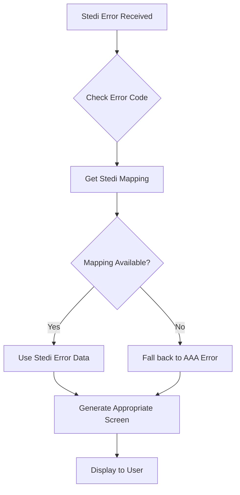

# Stedi Error Handling Implementation

This document outlines the implementation of the Stedi error code mapping system for the CuraLife quiz component.

## Overview

The Stedi error handling system provides comprehensive mapping of Stedi eligibility error codes to appropriate user-facing screens and messages. It categorizes errors into two main types:

1. **Technical Problem Errors** - System/Provider/Technical Issues
2. **Insurance Plans Errors** - Patient/Subscriber Data Issues

## Files Structure

```
src/js/utils/
├── stedi-error-mappings.js     # Core error mapping logic
├── test-stedi-mappings.js      # Test utilities
└── README-stedi-errors.md      # This documentation
```

## Error Code Categories

### Technical Problem Errors

These errors indicate system or provider-related issues that require technical support:

**Error Codes:** 04, 15, 33, 35, 41, 42, 43, 44, 45, 46, 47, 48, 49, 50, 51, 52, 53, 54, 55, 56, 57, 62, 63, 79, 80, 97, 98, AA, AE, AF, AG, AO, CI, E8, IA, MA, T4, NULL, other

**Screen Type:** `TECHNICAL_PROBLEM`
**User Experience:** Red error card with technical support messaging
**Action:** Manual technical resolution required

### Insurance Plans Errors

These errors indicate patient/subscriber data mismatches that may be user-correctable:

**Error Codes:** 58, 60, 61, 64, 65, 66, 67, 68, 69, 70, 71, 72, 73, 74, 75, 76, 77, 78

**Screen Type:** `INSURANCE_PLANS_ERROR`
**User Experience:** Orange warning card with verification guidance
**Action:** User can retry with corrected information or get manual verification

## Usage

### Basic Usage

```javascript
import { getStediErrorMapping, createStediErrorEligibilityData } from "./stedi-error-mappings.js";

// Get error mapping for a specific code
const mapping = getStediErrorMapping("72");
console.log(mapping.screenType); // "INSURANCE_PLANS_ERROR"
console.log(mapping.category); // "insurance_data"

// Create eligibility data object
const eligibilityData = createStediErrorEligibilityData("72", "Custom message");
console.log(eligibilityData.eligibilityStatus); // "INSURANCE_PLANS_ERROR"
```

### Quiz Integration

The system is automatically integrated into the quiz component:

1. **Error Processing** - `_createStediErrorEligibilityData()` method uses the mappings
2. **Screen Generation** - New screen generators for each error type
3. **Backwards Compatibility** - Falls back to existing AAA error handling if mappings unavailable

### Workflow Integration

Handle Stedi errors in your workflow responses:

```javascript
// Workflow response format
{
  eligibilityData: {
    eligibilityStatus: "STEDI_ERROR",  // or "INSURANCE_PLANS_ERROR", "TECHNICAL_PROBLEM"
    stediErrorCode: "72",
    userMessage: "Invalid member ID provided",
    error: {
      code: "72",
      message: "Member ID not found in system"
    }
  }
}
```

## API Reference

### Core Functions

#### `getStediErrorMapping(errorCode)`

Returns the complete error mapping configuration for a given code.

**Parameters:**

- `errorCode` (string|number) - The Stedi error code

**Returns:**

- `object` - Error mapping with screenType, category, userMessage, actionTitle, actionText, etc.

#### `createStediErrorEligibilityData(errorCode, customMessage?)`

Creates a formatted eligibility data object for use in the quiz system.

**Parameters:**

- `errorCode` (string|number) - The Stedi error code
- `customMessage` (string, optional) - Override the default error message

**Returns:**

- `object` - Formatted eligibility data object

#### `getErrorTitle(errorCode)`

Returns a user-friendly title for the error.

#### `isUserCorrectableError(errorCode)`

Checks if the error might be correctable by the user.

### Screen Generators

#### `_generateTechnicalProblemResultsHTML(resultData, resultUrl)`

Generates the HTML for technical problem errors.

#### `_generateInsurancePlansErrorResultsHTML(resultData, resultUrl)`

Generates the HTML for insurance plans errors.

## Configuration

### Quiz Configuration

Add error handling configuration to your quiz JSON:

```json
{
	"errorHandling": {
		"stediMapping": {
			"enabled": true,
			"fallbackToTechnical": true
		}
	},
	"ui": {
		"resultMessages": {
			"technicalProblem": {
				"title": "Technical Issue Detected",
				"subtitle": "We're resolving this for you."
			},
			"insurancePlansError": {
				"title": "Insurance Information Review",
				"subtitle": "Let's verify your details."
			}
		}
	}
}
```

### Liquid Template

The quiz section automatically includes the Stedi mappings:

```liquid
data-stedi-mappings-url="{{ 'stedi-error-mappings.js' | asset_url }}"
```

## Testing

### Browser Console Testing

Load the test utilities in the browser console:

```javascript
// Import the test module (development only)
import("./test-stedi-mappings.js").then(tests => {
	tests.testStediErrorMappings();
	tests.testErrorCategorization();
	tests.testBackwardsCompatibility();
});
```

### Test Functions

- `testStediErrorMappings()` - Test all error mapping functions
- `testErrorCategorization()` - Verify error categorization
- `testBackwardsCompatibility()` - Ensure AAA errors still work

## Error Flow



## Backwards Compatibility

The system maintains full backwards compatibility:

1. **Existing AAA Errors** - Codes 42, 43, 72, 73, 75, 76, 79 continue to work
2. **Fallback Handling** - If Stedi mappings fail to load, falls back to AAA error handling
3. **Screen Consistency** - New screens follow the same visual patterns as existing screens

## Troubleshooting

### Common Issues

1. **Mappings not loading** - Check browser console for asset URL errors
2. **Fallback to AAA errors** - Stedi mappings URL may be incorrect or file missing
3. **Unknown error codes** - System defaults to technical problem handling

### Debug Information

Enable debug logging by checking browser console for:

- "🔗 Loading Stedi error mappings from: [URL]"
- "✅ Stedi error mappings loaded successfully"
- "Using Stedi error mappings for error code: [CODE]"
- "Falling back to AAA error handling for error code: [CODE]"

## Future Enhancements

Potential improvements to consider:

1. **Dynamic Error Messages** - Context-aware messaging based on user data
2. **Error Analytics** - Track error frequency and types
3. **Retry Mechanisms** - Automated retry for transient errors
4. **Multi-language Support** - Localized error messages
5. **Error Escalation** - Progressive support escalation based on error severity
